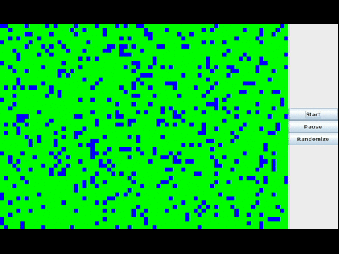

# Life
Life is a [JALSE](https://github.com/Ellzord/JALSE) example project that plays [Conway's Game of Life](https://en.wikipedia.org/wiki/Conway's_Game_of_Life).

* Any living cell with fewer than two or greater than three living neighbors dies.
* Any living cell with two or three living neighbors stays alive.
* Any dead cell with exactly three neighbors comes alive in the next generation.

## Building and running with Gradle

1. Build using `./gradlew build` (see [Building Java Projects with Gradle](https://spring.io/guides/gs/gradle/#_build_your_project_with_gradle_wrapper))
2. Run using `./gradle run` (See [The Application Plugin](http://gradle.org/docs/current/userguide/application_plugin.html))

Optionally you can also create an Eclipse project using `./gradlew eclipse` (see [The Eclipse Plugins](http://gradle.org/docs/current/userguide/eclipse_plugin.html)).

## Screen capture

## More

See the [Wiki](https://github.com/Ellzord/JALSE/wiki) for more information.
